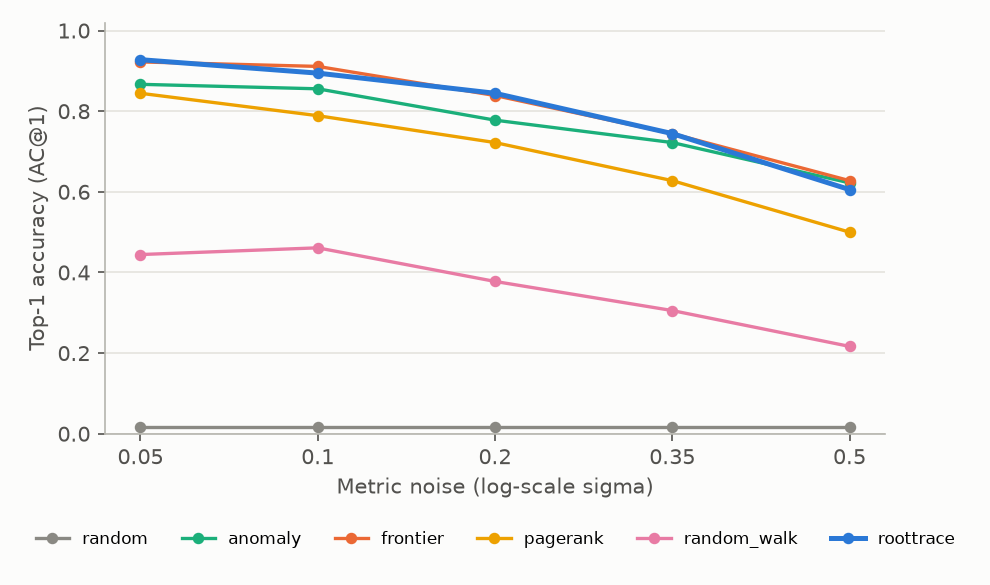
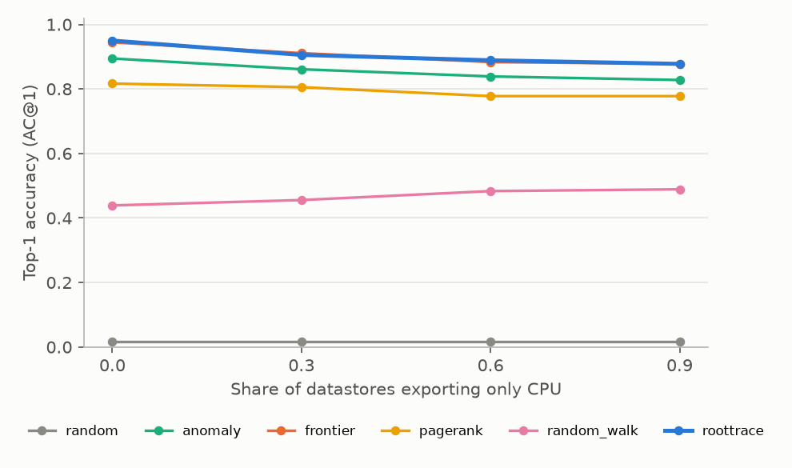
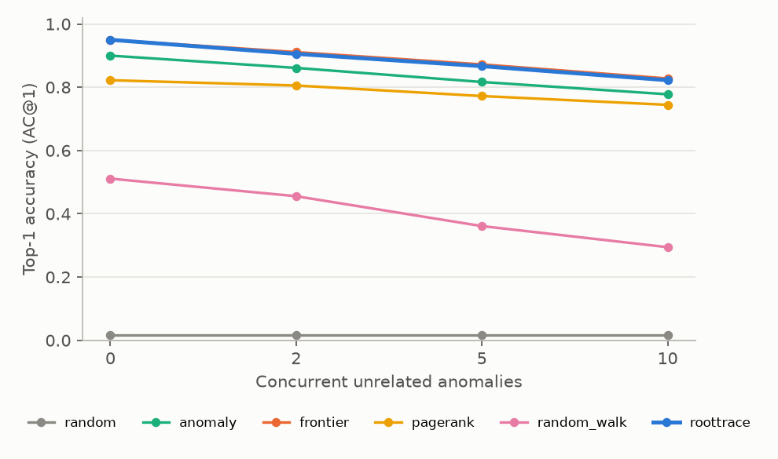

# RootTrace

[](https://github.com/VivekReddy2001/roottrace/actions/workflows/ci.yml)


**When a microservice system degrades, which component actually broke?**

A slow database makes every service that calls it slow, and the services
that call *those* services slow too. By the time someone gets paged, dozens
of components look anomalous and the one that caused it is often not the
loudest. RootTrace treats the system as a dependency graph, and ranks
components by how likely each one is to be the **root cause**. It uses the
anomaly evidence on each node and the way that evidence spreads along the
graph.

The repository has three parts:

1. **A reproducible benchmark.** A simulator builds realistic topologies,
   injects faults and generates telemetry. Six rankers are scored by top-k
   accuracy on held-out incidents.
2. **The rankers.** Two naive baselines, three published families of
   methods, and RootTrace's own combined ranker.
3. **A Neo4j backend.** Topologies and incident evidence are stored as a
   property graph. RCA questions ("where does the anomaly stop?", "how did it
   reach the user?", "what is the blast radius?") are answered in Cypher.

```text
$ python -m roottrace demo --neo4j
topology: 48 nodes, 141 edges
injected: latency fault at ca-04   (distractors: svc-003, svc-006)
anomalous components (z >= 3): 18

  random       frontend-0  svc-001  da-00  svc-026  svc-004
  anomaly      svc-019  svc-011  svc-022  svc-017  svc-020
  frontier     [ca-04]  svc-019  svc-011  svc-022  svc-017
  pagerank     [ca-04]  host-01  svc-019  svc-011  svc-022
  random_walk  frontend-0  [ca-04]  gateway-0  gateway-1  svc-019
  roottrace    [ca-04]  svc-019  svc-011  svc-025  svc-003

Neo4j
  frontier: ['ca-04']
  propagation path to ca-04: frontend-0 -> gateway-1 -> svc-004 -> ca-04
  blast radius of ca-04: 22 components
```

*A cache (`ca-04`) slowed down and 18 components became anomalous. Its
callers look far worse than it does: sorting by anomaly score alone puts
five victims first and the real root 15th. Graph-aware rankers put the
cache first. Neo4j then explains how the slowdown reached the user and how
far it could spread.*

---

## Results

All numbers come from `python -m roottrace benchmark` on **held-out seeds**.
Rankers were designed and tuned on a separate seed range (`dev`). The `test`
range was only run once the design was frozen, and a unit test asserts
the two ranges never overlap.

### Main benchmark: 600 incidents

3 topology sizes (20 / 50 / 100 services) × 4 fault types × 5 topologies × 10 incidents.

| Ranker | AC@1 | AC@3 | AC@5 | Avg@5 | MRR |
|---|---:|---:|---:|---:|---:|
| **roottrace** | **0.913** | **0.978** | **0.983** | **0.965** | **0.946** |
| frontier | 0.913 | 0.960 | 0.965 | 0.950 | 0.938 |
| anomaly | 0.857 | 0.945 | 0.955 | 0.926 | 0.902 |
| pagerank | 0.807 | 0.902 | 0.953 | 0.893 | 0.866 |
| random_walk | 0.470 | 0.723 | 0.842 | 0.695 | 0.624 |
| random | 0.027 | 0.077 | 0.112 | 0.073 | 0.097 |

*AC@k = share of incidents whose true root is in the top k. Avg@5 = mean of AC@1…AC@5. MRR = mean reciprocal rank.*

| Fault (AC@1) | anomaly | frontier | pagerank | random_walk | roottrace |
|---|---:|---:|---:|---:|---:|
| latency | 0.93 | 0.99 | 0.97 | 0.55 | 0.97 |
| errors | 0.89 | 0.93 | 0.95 | 0.55 | 0.95 |
| cpu (host) | 0.86 | 0.99 | 0.99 | 0.57 | 0.99 |
| subtle (+10–30% latency) | 0.74 | 0.74 | 0.32 | 0.22 | 0.75 |

### Robustness

Each point is 180 held-out incidents; one factor varies while the others stay at their defaults.

| Noise | Missing metrics | Concurrent unrelated anomalies |
|---|---|---|
|  |  |  |

Full tables: [`results/RESULTS.md`](results/RESULTS.md). Raw per-incident ranks: `results/main.jsonl`.

### What the results say

- **A simple "frontier" rule is a very strong baseline.** It flags the
  anomalous nodes that have no anomalous dependencies. It ties RootTrace at
  top-1 and beats both PageRank and the correlation random walk
  (CloudRanger/MicroCause-style) by a wide margin. Published RCA methods are
  often compared only against each other. This benchmark suggests always
  including it.
- **RootTrace's gain is in the top-3 and top-5 and under missing metrics,
  not in top-1.** It raises AC@3 from 0.960 to 0.978. Its "blind spot"
  inference also finds faults in datastores that export no latency or error
  metrics, which frontier cannot see by construction
  (`test_blind_spot_inherits_evidence_from_callers`).
- **PageRank over-credits shared infrastructure.** On subtle faults it drops
  to 0.32 top-1, because probability mass pools in heavily shared databases
  whether or not they are at fault.
- **Subtle faults are bounded by detection, not ranking.** A +10% slowdown
  often sits inside normal variation. No ranker can rank a node the detector
  never flagged, and anomaly, frontier and RootTrace all land at about 0.75.
- **Noise erases the differences.** The graph-aware lead over plain
  anomaly ranking is 5–6 points at low noise and gone by σ = 0.5, where
  anomaly, frontier and RootTrace are within 0.02 of each other (about 0.6
  top-1). PageRank and the random walk degrade fastest.

### Cost

Mean ranking time per incident: frontier 0.05 ms, PageRank 3 ms, RootTrace 12 ms, random walk 14 ms (pure Python / NumPy, one core).

---

## How it works

### The graph

An edge `u → v` means *u depends on v*: u calls v, or u runs on host v.
Faults propagate against edge direction, and RCA walks along it.
`roottrace.topology` generates layered call graphs (frontend → gateways →
2–4 service layers → datastores) with the features that make RCA hard:

- **Fan-in on shared infrastructure.** Datastore popularity is Zipf-skewed,
  so one database sits behind many services.
- **Co-location.** Services share hosts, so a host CPU fault looks like
  several unrelated services failing at once.

### The telemetry

`roottrace.simulate` produces per-minute **latency**, **error rate** and
**CPU** for every node:

| Mechanism | Why it matters |
|---|---|
| Caller latency = own time + Σ calls-per-request × dependency latency, with 0.5–2 calls per edge | Fan-out and retries *amplify* a fault upstream, so victims can look worse than the root |
| Errors propagate per edge with probability 0.3–0.9 | Retries hide some failures |
| Host CPU saturation slows every tenant | Host faults are indirect |
| Per-node noise levels; datastores noisiest | A fixed z-threshold behaves differently per node |
| **Unobserved datastores** (30% export CPU only) | Managed databases often expose no server-side latency |
| **Distractors**: unrelated slowdowns during the incident | Real systems rarely have exactly one anomaly |

Fault sizes are stated relative to what the root's callers normally see.
`latency` adds 100–300% of the node's normal end-to-end latency, `subtle`
adds 10–30%, `errors` adds a 20–50% error rate, and `cpu` saturates a host.

### Detection

A robust z-score per metric: the **median** of the incident window against
the baseline median, in baseline MADs. Using the median means a sustained
shift counts and a brief spike does not. A node's anomaly score is its
largest positive z.

### Rankers

| Ranker | Idea |
|---|---|
| `random` | Floor |
| `anomaly` | Sort by anomaly score; ignores the graph |
| `frontier` | Anomalous nodes with no anomalous dependency first ("where the anomalous region ends") |
| `pagerank` | Personalised PageRank along dependency edges, restarting in proportion to anomaly (after MicroRank) |
| `random_walk` | Correlation-weighted walk with backward and self transitions, started from the entry points (after CloudRanger / MicroCause) |
| **`roottrace`** | (1) **blind-spot inference**: an unobserved dependency inherits evidence from anomalous callers that have nothing else to blame; (2) a correlation-weighted walk that restarts in proportion to anomaly and stays where the anomaly stops propagating; (3) an **explained-away** discount for nodes whose anomaly is matched by a correlated, anomalous dependency |

## Neo4j backend

```text
(:Component {name, kind, layer})-[:CALLS]->(:Component)
(:Component)-[:RUNS_ON]->(:Component:Host)
(:Incident {id, fault, root})-[:SCORED {anomaly, observed}]->(:Component)
```

Per-incident scores live on `SCORED` relationships, so many incidents can
share one topology and be compared. The main queries are in
[`roottrace/neo4j_store.py`](roottrace/neo4j_store.py):

```cypher
// frontier: anomalous components none of whose dependencies are anomalous
MATCH (i:Incident {id: $incident})-[s:SCORED]->(c:Component)
WHERE s.anomaly >= $threshold
  AND NOT EXISTS {
    MATCH (c)-[:CALLS|RUNS_ON]->(d:Component)<-[t:SCORED]-(i)
    WHERE t.anomaly >= $threshold
  }
RETURN c.name, s.anomaly ORDER BY s.anomaly DESC
```

The integration tests check that the Cypher frontier matches the Python
one, that every ranker gives identical output on data read back from
Neo4j, that loading is idempotent (`MERGE` throughout), and that blast
radius equals the graph's ancestor set.

## Quick start

```bash
pip install -e ".[dev]"
python -m roottrace demo                 # one incident, every ranker
python -m roottrace benchmark            # full benchmark -> results/ (~2 min)
pytest                                   # unit tests (Neo4j tests skip)

# everything in containers: Neo4j + the demo against it
docker compose up --build demo

# or Neo4j in Docker, code on the host
docker compose up -d neo4j
NEO4J_URI=bolt://localhost:7687 python -m roottrace demo --neo4j
NEO4J_URI=bolt://localhost:7687 pytest   # includes the integration tests
```

The Neo4j browser is at http://localhost:7474 (user `neo4j`, password
`roottrace-dev`; for local development only). Try
`MATCH p=(:Component {kind:'frontend'})-[:CALLS*]->(:Component {kind:'database'}) RETURN p LIMIT 25`.

## Project layout

```text
roottrace/
  topology.py     layered dependency graphs with hosts and shared datastores
  simulate.py     telemetry + fault injection (4 fault types, distractors, blind spots)
  detect.py       robust median/MAD anomaly scores
  rank.py         six rankers
  evaluate.py     AC@k / Avg@5 / MRR, dev/test seed split
  report.py       benchmark runner, tables, figures
  neo4j_store.py  property-graph model and Cypher queries
tests/            unit tests + Neo4j integration tests
results/          benchmark output committed for reference
```

## Limitations

- The telemetry is simulated. The simulator is designed to include the
  failure modes that break RCA methods in practice (amplification, blind
  spots, co-location, concurrent anomalies), but absolute accuracies on
  real traces will be lower. The *relative* findings are the useful part,
  above all how strong the frontier baseline is.
- One root cause per incident. Cascading multi-root failures are not
  modelled.
- The anomaly threshold (z ≥ 3) is fixed across nodes rather than learned.

## License

MIT, see [LICENSE](LICENSE).
